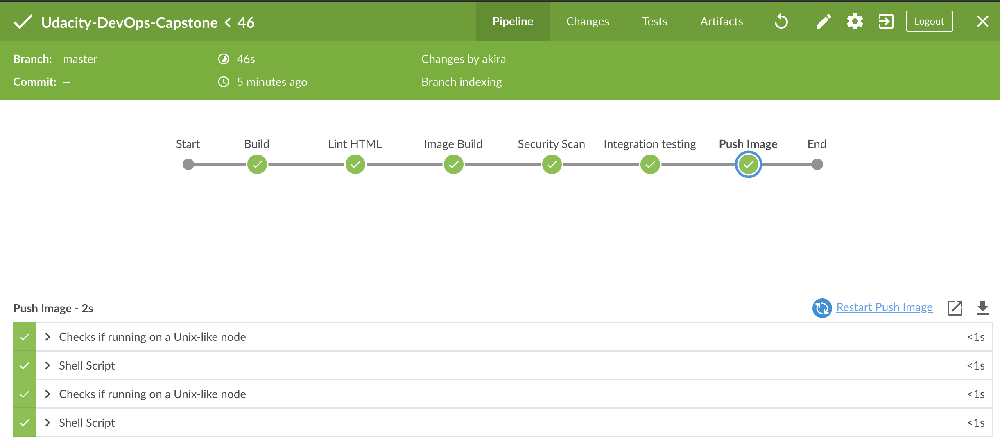
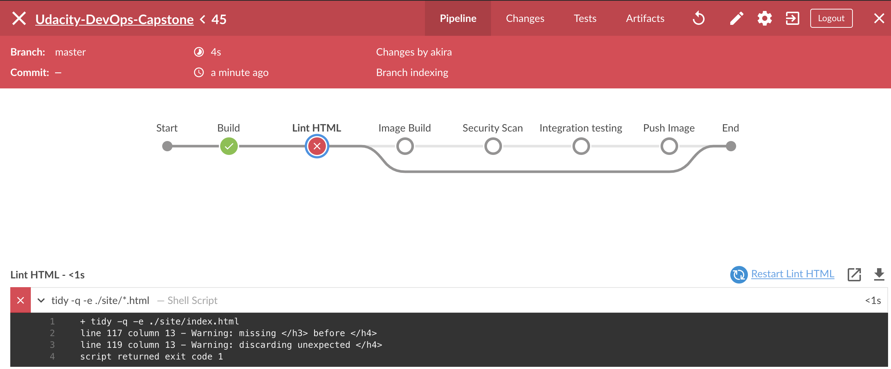
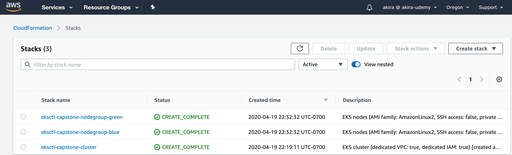
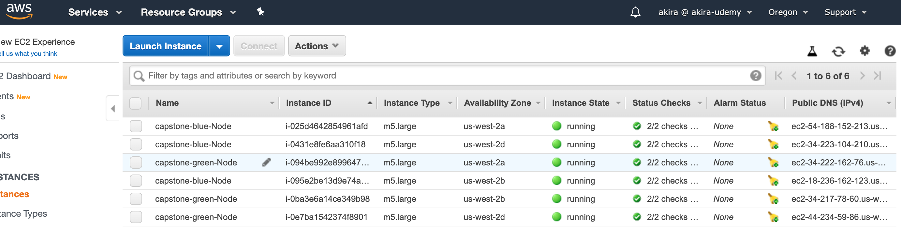
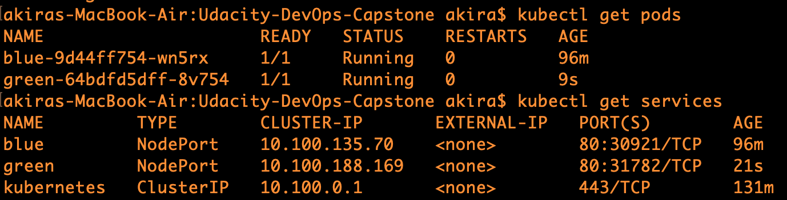

# Udacity Cloud DevOps Nanodegree Capstone Project
In this project combines all the skills learned in the Udacity's Cloud DevOps nanodegree program to build
an automated CI-CD pipeline that deploys a static website into a Kubernetes cluster hosted with AWS EKS.

Every code change pushed into this repository is validated by a Jenkins pipeline. 
The `master` branch is considered the desired state of the deployed application and as soon as all validation steps
are a pass, the application is deployed into the Kubernetes cluster in a Blue-Green fashion.
Below are the stages the application has to pass that lead to a successful deployment:

- Static code validation (linting) for index.html
- Docker container build
- Container scan for vulnerabilities
- Integration testing
- Push container to Docker registry

if there is anything voliates with the linting, the pipeline will be broken:

## The Application

The application is a simple static website hosting

### High Availability

The application is hosted in a Kubernetes cluster designed for high availability. The cluster has three nodes hosted in EC2 instances
covering different AZs (Availability Zones) in the AWS VPC.

### Security

The application is deployed using automated build steps from a Continuous Integration server that has been granted minimun permissions to all
the managed resources without using root accounts:

- connects to DockerHub with access token to push new images to the repo
- `kubect` access the Kubernetes API endpoint with a service account with limited namespace access
- access to EC2 instances is limited using *AWS SecurityGroups*

# The Jenkins Pipeline

The date translation application is deployed by a CI/CD pipeline with Jenkins CI.
The pipeline is divided in the following sections:
- Application containerization and security scan
- Lint Testing
- Itegration Testing

### Application containerization and security scanning

After the linting phase, the application container is created form the `./Dockerfile`. The generated docker image should be pushed into the DockerHub registry [vampire2008/capstone](https://hub.docker.com/repository/docker/vampire2008/capstone)

As part of the docker build, a security scan is performed on the image just generated using *Aqua Microscanner*.

### Integration testing

A simple integration test is performed against a running container to verify the dockerized application can run and respond to simple requests.
The application is very simple so this validation is performed with a few `curl` commands

# Application deployment

The webapp is deployed into a Kubernetes cluster hosted with Amazon EKS. The deployment is performed in a **Blue-Green** fashion. 
I was using the eksctl tool to leverage to Cloudformation to create a EKS cluster, the command is located at `k8s-cluster.sh` file. The following snapshots indicates both the cloudformation stacks and worker nodes are successfully built.

After the cluster is ready, update the kube config file, and apply for the deployment and services yaml files.

Since the first time running Jenkins pipeline to deploy blue webapp, then nevigate to the `localhost:30921`, here what I got:

After update the html with the new image, then trigger the Jenkins pipeline to run, we will get the green webapp by typing  `localhost:31782`

